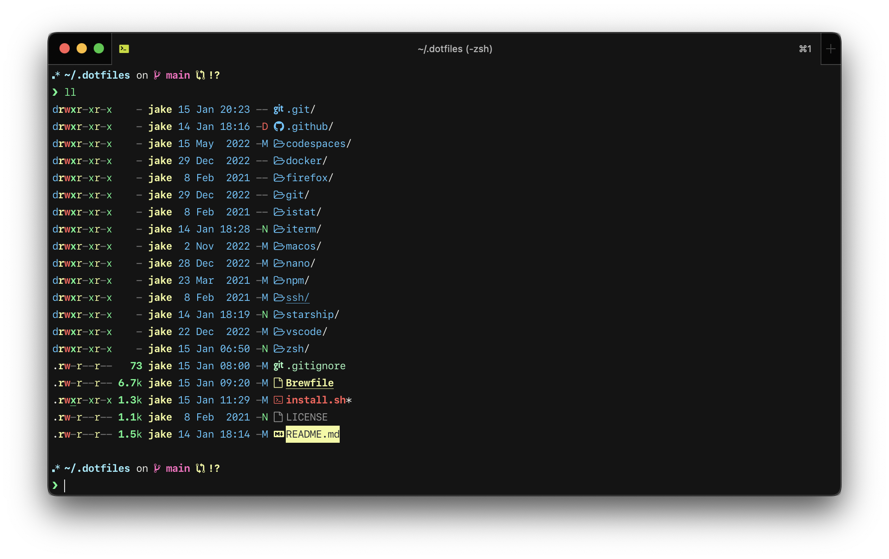

# 💻 My .files



Just a personal backup of my MacBook's setup. Certainly not a drop-in solution for anybody's machine except my own, but maybe a few lines will prove useful to you.

(...in other words, after stealing so many sick bash hacks from people on here who are much smarter than me, I felt obligated to keep the repo public. And in even more words, **_use the automated scripts at your own risk!_**)

All of the juicy stuff you're probably looking for is at:

- [`zsh/custom/plugins.zsh`](zsh/custom/plugins.zsh), [`zsh/custom/aliases.zsh`](zsh/custom/aliases.zsh), and [`zsh/custom/functions.zsh`](zsh/custom/functions.zsh) for my ZSH hacks.
- [`macos/defaults.sh`](macos/defaults.sh) for my macOS defaults.
- [`Brewfile`](Brewfile) for my far-too-long list of binaries and apps I "need" installed.
- [`firefox/user.js`](firefox/user.js) for my Firefox settings.
- [`vscode/`](vscode/) for my VS Code settings and keybinds.
- See [my /uses page](https://jarv.is/uses/) for even more details.

## Usage

Designed for macOS, also works on Linux (specifially Debian and Ubuntu):

```bash
git clone https://github.com/jakejarvis/dotfiles.git ~/.dotfiles
cd ~/.dotfiles
./install.sh
```

or:

```bash
curl -fsSL jrvs.io/bootstrap | bash  # but probably don't do this if you're not me
```

## License

[MIT](LICENSE)
